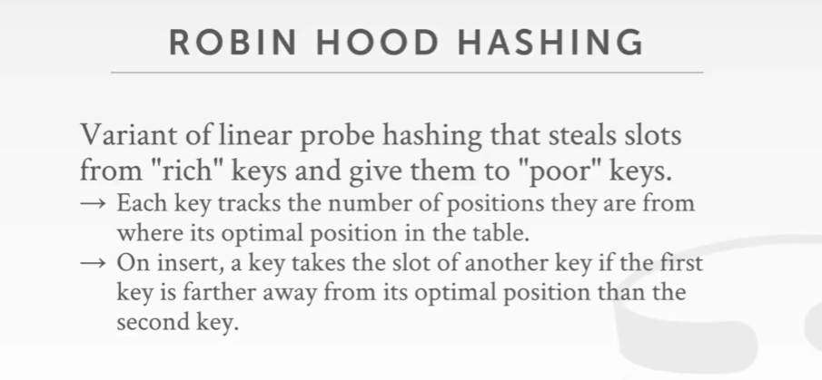
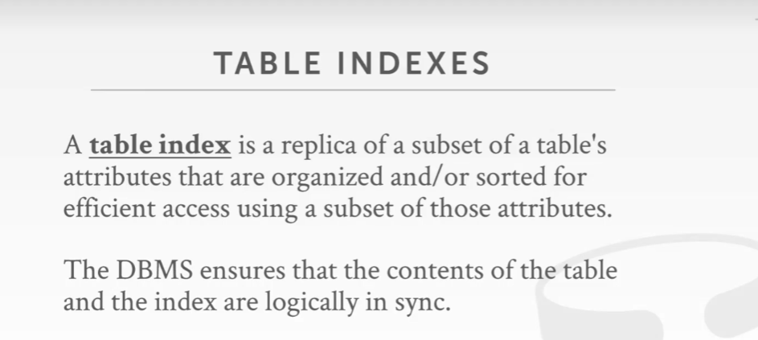
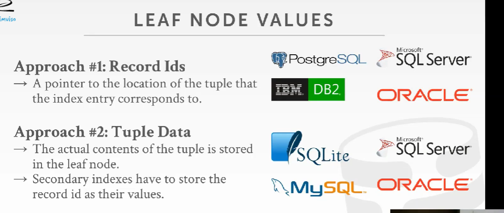
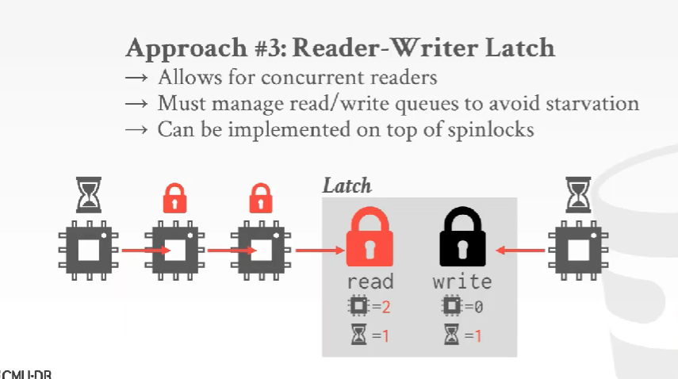
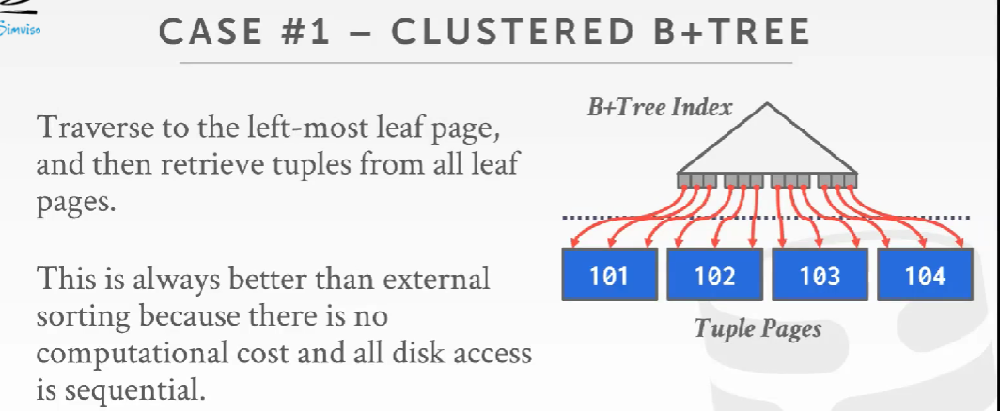
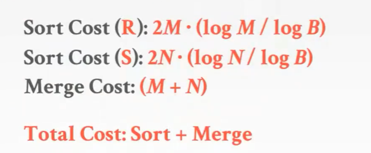
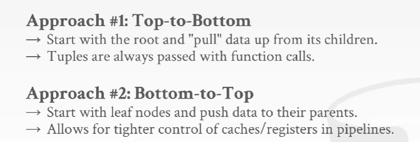
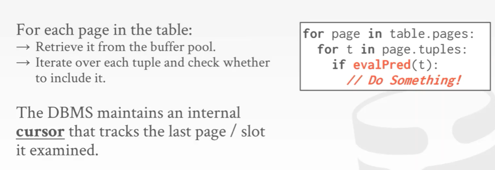
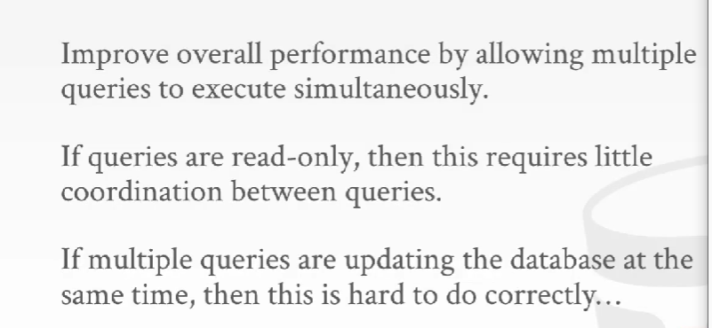
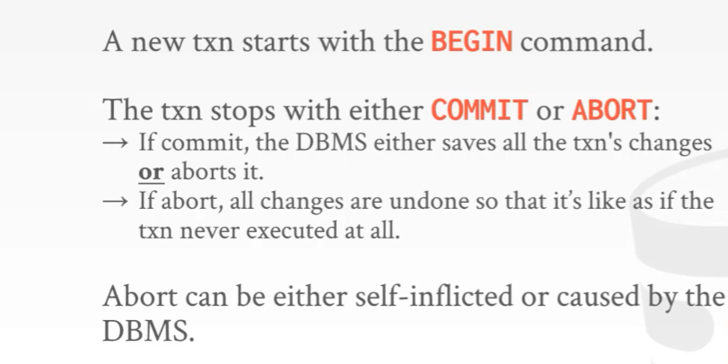

# CMU 15-445/645 笔记

这里有个笔记写的很好的网站，以后还是看这个吧：

https://zhenghe.gitbook.io/open-courses/cmu-15-445-645-database-systems/

## 1.数据库储存

待补

## 2. Buffer池与内存管理

待补

## 3. Hash Table

### 3.1 Hash Table的组成

由hash函数和hash模式组成

#### 3.1.1 Hash Function

对于hash函数，我们关心的是碰撞率和速度

下面是常见的数据库使用的hash函数，其中**XXHASH**是速度和碰撞率都很优秀的hash函数，我们在设计数据库的时候可以考虑该函数。

#### 3.1.2 Hashing Schemes

##### (1) Static Hashing Schemes

静态hash schemes: 当我们分配内存时，我们一开始就得知道我们希望保存的key的数量

下面列出三种 static hashing schemes

* Linear Probe Hashing
* Robin Hood Hashing
* Cuckoo Hashing

###### Linear Probe Hashing

构造一个圆形数组，首先用hash函数分配到一个offset，如果该位置有元素了则顺序往下扫描直到遇到一个空slot则放入，查询同理。

如果元素数量为n，则数组大小一般为2*n，扩容类似。

这里删除会出现一些问题，提供两种解决方案：

* 为删除位置添加**墓碑标记**（推荐）
* 数据整体移动（事实上，处理会比较麻烦）

###### Non-unique Keys

有时候我们的key-value键值对不是唯一的，这意味着我们一个key对应着多个value

###### Robin Hood Hashing

###### Cuckoo Hashing

这个hash方法是让我们创建多个hash table，每个hash table有不同的hash函数(同一个hash函数但不同的seed，一般来说两个hash table足矣)，对于一个元素A，我们分别在每个hash table找到对应的offset，如果有空的slot则插入(有多个则随机插入一个)，如果没有则随机选择一个位置，让对应位置元素重新hash，重新选择slot，然后该元素插入进去(就好像把它位置抢占了一样)，如果回溯到起点仍然没有找到，则说明需要扩容了。

##### (2) Dynamic Hashing Schemes

静态hash在修改大小时候需要对所有元素进行重构(可以简单理解为元素上限n已经改变了，即取模值n变了)，这样在每次重构的时候非常费时，动态hash则无需重构整个hash table而根据需要调整大小，下面我们介绍三种动态hash方法

* Chained Hashing
* Extendible Hashing
* Linear Hashing

###### Chained Hashing

Chained Hashing就是挂链hash，把冲突的元素用链表串在一起。

###### Extendible Hashing

主要思想是通过一个全局counter来确定有多少位bit来决定元素应该处于哪个bucket，每个bucket有一个局部counter，找到bucket放入或者在bucket顺序扫描即可，具体可以看这个博客：

https://blog.csdn.net/whynottrythis/article/details/109566391

###### Linear Hashing

不同于Extendible Hashing，这个分裂bucket来扩展空间是按着pointer循环分裂的。

(说实话，并没有怎么懂，🐎的后面再来看)

## 4. Table Index

### 4.1 B-Tree Overview

#### 4.1.1 B+Tree

##### B+Tree 特性

##### nodes

##### B-Tree VS B+Tree

##### B+Tree Insert

这里有一个不错的演示网站:[B+ Tree Visualization (usfca.edu)](https://www.cs.usfca.edu/~galles/visualization/BPlusTree.html)

##### B+Tree Delete

##### Variabel Length keys

##### Non-Unique Indexs

我们可以用两种方法来处理非唯一索引:

* Duplicate Keys
* Value Lists

##### Intra-node Search

* Linear
* Binary
* Interpolation

##### Optimizations

* Prefix Compression
* Suffix Truncation
* Bulk Insert
* Pointer Swizzing

### 4.2 Indexs

#### 4.2.1 Implicit Indexs

当我们创建表的时候，DBMS会自动帮我们创建一些索引

#### 4.2.2 Partial Indexs

为数据集上的部分数据做索引（比如只对本月数据做索引），可以加快索引的速度。

#### 4.2.3 Covering Indexs

#### 4.2.4 Index Include Columns

#### 4.2.5 Function/Expression Indexs

#### 4.2.6 Trie Index

在B+树中，它无法告诉你一个索引是否存在，这意味着你必须到叶子节点才能知道是否索引存在。

我们可以用一种索引: trie index

##### Trie index properties

##### Trie key span

##### Radix Tree

## 5. Multi-Threaded Index Concurrency Control

### 5.1 Locks VS Latches

在数据库层面，locks是一种更高级的表示，它保护了数据库中的逻辑内容(比如一个tuple，一张表或者整个数据库等等)，当同一时间有其他事务在运行时，我们会用这些lock来保护逻辑对象。

在低级层面，我们所关心的就是用来保护数据结构或者对象的物理完整性的latch，latch会去保护数据库系统的关键部分，即保护内部数据结构免受其他线程对该数据结构或者对象同一时刻进行读写所带来的问题。因此我们只会在一小部分时间持有latch，只会在关键部分进行所需操作的时候持有这个latch。比如对一个page进行修改的时候。

#### 5.1.1 Latch Mode

#### 5.1.2 Latch Implementations

方法一: 使用OS层面的mutex

方法二：Test-and-Set Spin Latch

方法三: Read-Write Latch

#### 5.1.3 Hash Table Latching

下面我们来看一个例子，如何在hash table中使用latch（page latch和slot latch）

    
        
     

### 5.2 B+ Tree Concurrency Control

#### 5.2.1 Latch Crabbing/Coupling

具体做法如下：

* 对于读操作：我们每次获得孩子的一个R锁，进入到孩子节点，然后释放父节点的锁
* 对于写操作：我们每次获得孩子的一个W锁，进入到孩子节点并检查该节点是否safe，如果safe则释放祖先节点的所有锁。(因为孩子节点safe表明了不会对祖先节点产生分裂或者合并操作)

#### 5.2.2 Better Latching Algorithm

我们可以假设在实际中插入/删除的次数并不多，因此我们可以先用R锁在遍历Inner-node的时候，直到leaf-node我们才用W锁，如果此时leaf-node并不需要拆分/合并，那么我们赌对了，前面的节点都不用变化，反之我们就重新从根节点开始再次遍历，并且每个节点都用W锁。这就是乐观锁机制。

#### 5.2.3 Leaf Node Scan

在前面的遍历/修改中，由于我们始终是从上到下的操作，所以并不会引起死锁的问题，但是在B+Tree中我们还可以对leaf-node进行左右遍历从而实现范围查询，这样就有可能出现对同一个节点争抢的情况，即死锁。

解决这个问题的方法就是：当线程A左右遍历leaf-node时如果取不到latch，那么就让线程A重新执行原操作(比如从头进行查询)。事实上，重新执行比超时重试可能更好，只要一直重新执行，我们总能预期获得一个结果。

#### 5.2.4 Delayed Parent Updates

当一个leaf-node需要被split的时候，我们仅仅只对它进行拆分，而对父亲节点的影响留到后面来做。这样我们就不需要重新开始并拿着write latch一路往下遍历了。(仍然是乐观锁机制)

举个例子：

## 6. Sorting + Aggregations

在学习这个之间，我们首先来整体看一下什么是查询计划

### 6.1 Sorting

#### 6.1.1 Why Need Sort

#### 6.1.2 External Merge Sort

考虑到有可能内存无法装下所有page，因此传统的排序算法是不能直接应用的，因此我们需要用外部排序。

##### 2-Way External Merge Sort

对于二路外部归并排序来说，一个简单的优化就是对page进行预取

当然对于多路归并排序我们同样也可以做出拓展

#### 6.1.3 Using B+Trees For Sorting

总的来说，如果这是一个clustered index，查询需要根据索引所基于的key对数据进行排序，那么直接使用B+树进行排序是非常好的，否则如果不是一个clustered index，那么就放弃这种想法吧。

### 6.2 Aggregations

#### 6.2.1 Sorting Aggregation

可以先进行过滤，然后去掉不需要的列，然后通过排序进行聚合。

#### 6.2.2 Hashing Aggregation

如果内存满了，DBMS不得不将数据写回磁盘，那么就需要用到外部hash聚合。

##### Partition

##### Rehashing

再次hash的目的是：因为第一次hash保证了key的局部性，即相同的key只会存在同一个分区，但是一个分区可能包含不同的key，再次hash就是对每个分区的key计算聚合结果了。

#### 6.2.3 Hashing Summarization

#### 6.2.4 Cost Analysis

#### 6.2.5 Conclusion

## 7. Join Algorithm

下面我们会讨论这几个问题：

* Join Operator Output Data
* I/O Cost Analysis
* Join Vs Cross-Product

 Join Operator Output Data

I/O Cost Analysis

Join Vs Cross-Product

下面我们来具体介绍三个join相关的算法

* Nested Loop Join
* * Simple/Stupid
  * Block
  * Index
* Sort-Merge Join
* Hash join

### 7.1 Nested Loop Join

#### 7.1.1 Stupid Nested Loop Join

#### 7.1.2 Block Nested Loop Join

一个改进是如果内存提供**B**个buffers，则我们可以将**B-2**个buffer用于读取outer page，1个buffer读取inner page，一个buffer用于输出

另一个改进是对某一列进行索引，这样会加快我们查找的速度

总结一下

### 7.2 Sort-Merge Join

下面给出一种近似算法描述

值得注意的是，这里有可能触发Inner join的回溯，比如R表有两个A值，S表也有两个A值，RA1会匹配到SA1和SA2，然后S游标移动到SA2的下一个位置的时候，发现比RA1大，则R的游标往下移动得到RA2，发现数值与RA1相同，则需要对S的游标回溯到SA1重新进行匹配这个步骤。

对应的时间复杂度分析

当然如果R表和S表对应连接的列值全部一样就退化为了Nested Loop Join

### 7.3 Hash Join

下面是一个简单的算法描述和演示

当hash table过大的时候，我们也可以对inner page先做一次bloom filter，先判定待查询的值是否在

hash table中，这样可以减少I/O次数（[详解布隆过滤器的原理，使用场景和注意事项 - 知乎 (zhihu.com)](https://zhuanlan.zhihu.com/p/43263751)）

#### 7.3.1 Grace Hash Join

当两个 table 都无法放入 memory 时，我们可以：

- Phase #1: Build
  - 将两个 tables 使用同样的 hash function 进行 partition，使得可能配对成功的 tuples 进入到相同的Partition
- Phase #2: Prob
  - 对两个 tables 的每一对 partition 分别进行 Join

如果每个 partition 仍然无法放入内存中，则可以递归地使用不同的 hash function 进行 partition，即 recursive partitioning：

成本分析：

假设我们有足够的 buffers 能够存下中间结果：

- Partitioning Phase:
  - Read + Write both tables
  - 2(M+N) I/Os
- Probing Phase
  - Read both tables
  - M+N I/Os

### 7.4 总结

## 8. Query Execution

### 8.1 Processing Model

一个执行模型(processing model)决定了DBMS如何去执行一个查询计划。下面有三种方法:

* Iterator Model
* Materialization Model
* Vectorized/Batch Model

#### 8.1.1 Iterator Model

下面我们来看一个例子，感觉和MIT 6.830的迭代器模型很像

总结一下

#### 8.1.2 Materialization Model

和Iterator Model不同的是，不是每次返回一条tuple，而是返回所有的tuples给上层处理。

可以看下图，每次输出都是一个out buffer，而不是single tuple

#### 8.1.3 Vectorization Model

和Iterator Model不同的是，每次返回一批tuples(a batch tuples)

### 8.2 Plan Processing Direction

* Top-to-Bottom
* Bottom-to-Top

### 8.3 Access Methods

#### 8.3.1 Sequential Scan

#### 8.3.2 Index Scan

#### 8.3.3 Multi-Index Scan

### 8.4 Process Model

主要有以下三种方式

* Process per DBMS Worker
* Process Pool
* Thread per DBMS Worker

#### 8.4.1 Process per DBMS Worker

#### 8.4.2 Process Pool

#### 8.4.3 Thread per DBMS Worker

### 8.5 Inter-Query And Intra-Query

#### 8.5.1 Inter-Query Parallelism

#### 8.5.2 Intra-Query Parallelism

下面有三种方法来进行intra-query parallelism

* Intra-Operator(Horizontal)
* Inter-Operator(Vertical)
* Bushy

##### Intra-Operator(Horizontal)

下面我们来看一个例子，Exchange Operator调用三个线程同时执行相同操作

Exchange Operator的不同类型

##### Inter-Operator(Vertical)

下面来看个例子(好吧我并没有怎么懂这个玩意儿...)

##### Bushy

### 8.6 Conclusion

## 9. Query Planning & Optimization

### 9.1 Heuristics/Rules

#### 9.1.1 Predicate Pushdown

核心思想：先进行filter，再进行join

#### 9.1.2 Projection

核心思想：尽早的projections

### 9.2 Cost-based Search

#### 9.2.1 Statistics

#### 9.2.2 Derivable Statistics

#### 9.2.3 Complex Predicate

#### 9.2.4 Cost Estimations

一种方法是根据直方图来估计选择率，另一种方法是对数据库进行采样来估计选择率。这里只列出了如何利用直方图进行选择率的估计。

区间直方图，按照相同的范围划分bucket

按照尽可能接近的数值总和划分bucket

#### 9.2.5 Candidate Plan

这里主要讲的是多表连接的时候如何选择最后的连接方式从而得到最好的效率，因为无论连接顺序如何，得到的结果总是一样的。

有趣的是，在Postgres Optimizer中，如果连接的表＞13，会采用一种模拟退火的算法来获得近似最优解。

#### 9.2.6 Nested Sub-Queries: Decompose

核心思想：将嵌套查询先做，并将结果保存为一个变量。

### 9.3 Conclusion

## 10. Concurrency Control Thoeory

### 10.1 Transaction

关于事务概念就不过多赘述，主要是满足ACID特性。

#### 10.1.1 Atomicity

##### Mechanisms For Ensuring Atomicity

#### 10.1.2 Consistency

#### 10.1.3 Isolation

##### Mechanisms For Ensuring Isolation

#### 10.1.4 Others

至于持久性，这个问题放到了日志那一部分来讲。后面还讲了事务的序列化以及冲突相关知识，跟教材上讲的基本一致，这里就不写出来了。

这里提一下用循环等待图来判断是否是冲突可序列化的

### 10.2 Conclusion

## 11. Two-Phase Locking Concurrency Control

### 11.1 Basic Look Types

### 11.2 Executing With Locks

### 11.3 Concurrency Control Protocol

#### 11.3.1 Tow-Phase Locking

#### 11.3.2 String Strict Two=Phase Locking

简单来说：锁的释放只会在事务提交/丢弃阶段，而不会出现释放所以后还会对page进行某些操作

#### 11.3.3 2PL Deadlocks

#### 11.3.4 DeadLock Handling

##### Victim Selection

##### Rollback Length

#### 11.3.5 Timestamp Ordering(T/O)

##### Timestamp Allocation

#### 11.3.6 Basic T/O

##### Reads

##### Writes

##### Thomas Write Rule

